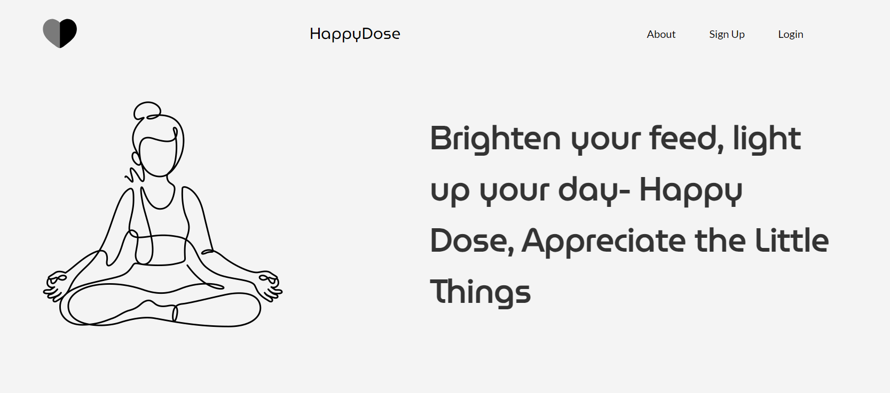
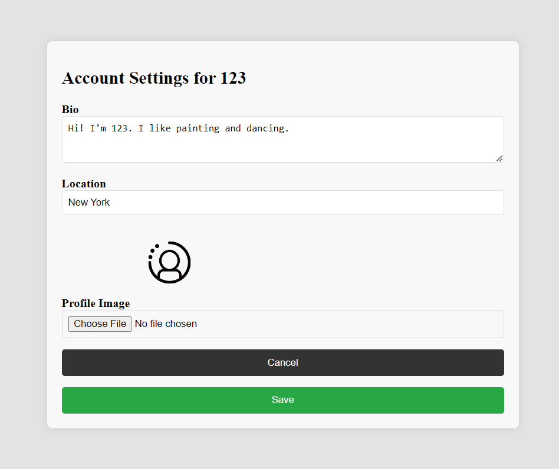

# Happy-Dose

## Description
Happy Dose is a platform designed to encourage and spread happiness by creating a positive community. Users can share moments that made them happy, fostering gratitude and enhancing overall well-being. Expressing gratitude has shown signs of boosting dopamine and serotonin which improves mood and well-being. 

Citation: https://healthcare.utah.edu/healthfeed/2021/11/practicing-gratitude-better-health-and-well-being#:~:text=%22Expressing%20gratitude%20can%20positively%20change,%2C%20and%20well%2Dbeing.%22

## Features
* User Authentication: Secure user authentication system for account creation and login.
* Post Happiness: Share moments that brought joy to your life with the community. You can post a picture and add a caption.
* Ability to like posts and follow your friends and family
* Responsive Design: Enjoy a seamless experience across various devices with our responsive design.

## Screenshots

